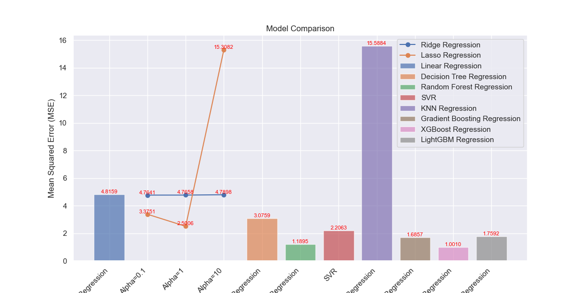
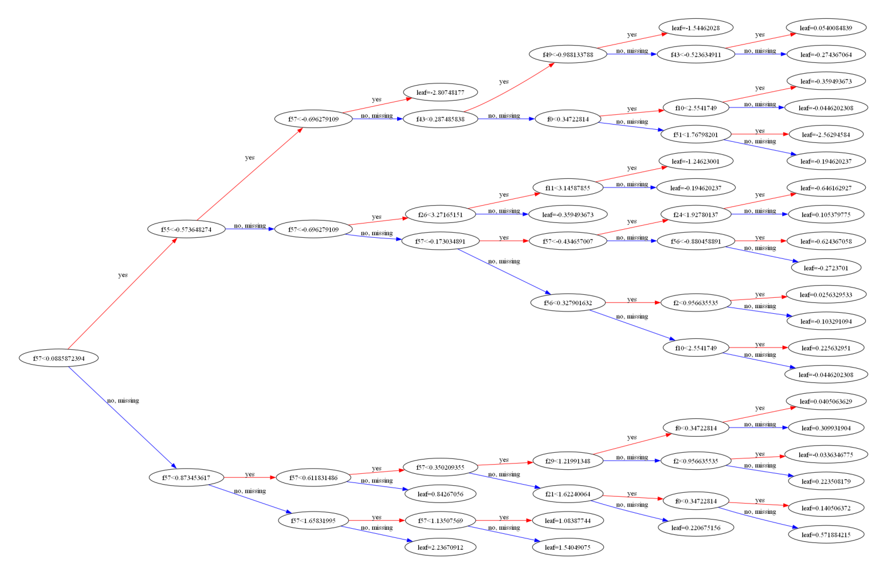

# Students Marks Data Analysis and Machine Learning Models

This repository contains an analysis of students' marks data, along with the implementation of machine learning models to predict student performance. The XGBoost model has shown promising results in this analysis.



## Dataset

The dataset used for this analysis contains information about students, including features such as age, study time, and previous marks. The goal is to explore patterns and predict students' final marks.

## Exploratory Data Analysis (EDA)

The EDA process includes:

- Data cleaning and preprocessing
- Exploring the distribution of marks
- Correlation analysis between different features
- Visualizing relationships between variables

## Machine Learning Models

Several machine learning models were implemented to predict students' final marks. The models include:

1. Linear Regression
2. Ridge Regression
3. Lasso Regression
4. Decision Tree Regression
5. Random Forest Regression
6. Support Vector Regression (SVR)
7. K-Nearest Neighbors Regression (KNN)
8. Gradient Boosting Regression
9. XGBoost Regression
10. LightGBM Regression

## Model Evaluation

The models were evaluated based on metrics such as Mean Squared Error (MSE), R-squared (R2) score, and Mean Absolute Error (MAE). XGBoost demonstrated superior performance compared to other models.

## Results

The XGBoost model was selected as the final model due to its high accuracy and robustness. Visualizations of the XGBoost tree structure have been included for better understanding.

## Repository Structure

- `data/`: Contains the raw and processed datasets.
- `notebooks/`: Jupyter notebooks for EDA and model development.
- `models/`: Saved machine learning models.
- `visualizations/`: Visualizations generated during the analysis.

## How to Use

1. Clone this repository:

   ```bash
   git clone https://github.com/Mohshaikh23/Student-Data-Analysis.git
   ```

2. Navigate to the repository:

   ```bash
   cd students-marks-analysis
   ```

3. Explore the notebooks in the `notebooks/` directory for detailed analysis.

4. Run the provided notebooks to replicate the analysis or train new models.

Feel free to reach out for any questions or additional information.

Happy coding!
```